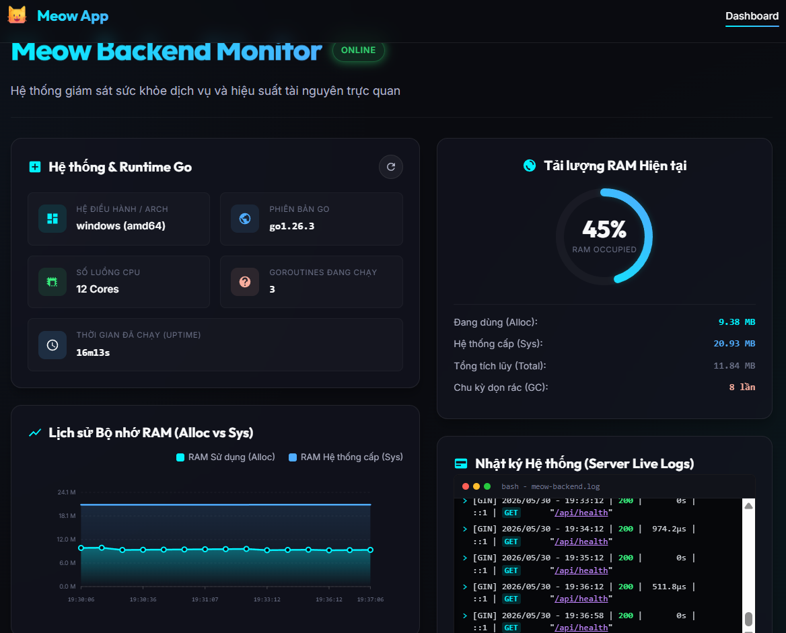

# 🐱 Meow Application



Chào mừng bạn đến với **Meow Application**! Đây là tài liệu hướng dẫn tổng quan và cách thiết lập môi trường phát triển (Setup Development Environment) cho các developer khi pull source code dự án về máy local.

Dự án được xây dựng theo mô hình tách biệt giữa **Backend** và **Frontend**. Hiện tại, hệ thống đã hoàn thành cả phần **Backend** (Go) phục vụ API giám sát và phần **Frontend** (SvelteKit) hiển thị bảng điều khiển (Dashboard) trực quan sinh động với các biểu đồ theo thời gian thực.

---

## 📂 Cấu trúc thư mục dự án

Thư mục gốc của dự án có cấu trúc như sau:

```text
meow/
├── backend/            # Mã nguồn phía máy chủ (Go / Gin Framework)
│   ├── controllers/    # Bộ điều khiển điều phối HTTP request & response (Health status, logs)
│   ├── services/       # Xử lý logic nghiệp vụ (Business Logic thu thập RAM, CPU, uptime)
│   ├── docs/           # Tài liệu API Swagger được sinh tự động
│   ├── .env.example    # Mẫu định cấu hình biến môi trường
│   ├── main.go         # Điểm khởi chạy của ứng dụng (Entrypoint)
│   └── ...
├── frontend/           # Giao diện quản lý trực quan sinh động (SvelteKit / Svelte 5 / Vite)
│   ├── src/            # Thư mục mã nguồn chính của giao diện
│   │   ├── lib/        # Các thành phần tái sử dụng (components, assets...)
│   │   ├── routes/     # Các trang và router của SvelteKit (Dashboard UI)
│   │   ├── app.css     # Giao diện Vanilla CSS cao cấp với Glassmorphism
│   │   └── app.html    # Template HTML gốc
│   ├── static/         # Các tài nguyên tĩnh (images, icons...)
│   ├── .env.example    # Mẫu định cấu hình biến môi trường kết nối API
│   ├── package.json    # Quản lý thư viện phụ thuộc và scripts chạy dự án
│   └── ...
├── go.work             # Go Workspace file giúp quản lý đa mô-đun
└── README.md           # Hướng dẫn này
```

---

## ⚙️ Hướng dẫn Setup Backend (Go)

Backend của dự án được viết bằng ngôn ngữ **Go (Golang)**, sử dụng framework **Gin** mạnh mẽ và hiệu năng cao.

### 📋 Yêu cầu hệ thống (Prerequisites)

Đảm bảo bạn đã cài đặt phiên bản Go phù hợp trên máy tính của mình:

- **Go Version:** `1.26.3` trở lên. Bạn có thể kiểm tra bằng lệnh:
  ```bash
  go version
  ```

### 🚀 Các bước khởi chạy local

Thực hiện lần lượt các bước dưới đây từ cửa sổ terminal của bạn:

#### 1. Di chuyển vào thư mục backend

```bash
cd backend
```

#### 2. Cấu hình biến môi trường

Sao chép tệp mẫu cấu hình môi trường `.env.example` thành `.env`:

- **Windows (PowerShell):**
  ```powershell
  Copy-Item .env.example .env
  ```
- **macOS / Linux / Git Bash:**
  ```bash
  cp .env.example .env
  ```

Mở tệp `.env` vừa tạo và tùy chỉnh các thông số cấu hình nếu cần (mặc định PORT chạy ở cổng `8080`):

```env
PORT=8080
```

#### 3. Tải các thư viện phụ thuộc (Dependencies)

Tải và cài đặt các module Go được định nghĩa trong `go.mod`:

```bash
go mod tidy
```

#### 4. Khởi tạo tài liệu API Swagger (Bắt buộc)

Vì thư mục `docs/` chứa tài liệu Swagger đã được cấu hình trong `.gitignore` để tránh xung đột mã nguồn khi commit, bạn cần tự sinh (generate) lại thư mục này dưới local trước khi chạy ứng dụng:

- **Bước A: Cài đặt công cụ `swag`** (nếu máy của bạn chưa cài đặt):

  ```bash
  go install github.com/swaggo/swag/cmd/swag@latest
  ```

  _(Chú ý: Hãy đảm bảo thư mục bin của Go - mặc định là `%USERPROFILE%\go\bin` trên Windows hoặc `$GOPATH/bin` / `$HOME/go/bin` trên macOS/Linux - đã được thêm vào biến môi trường `PATH` của hệ thống để có thể nhận lệnh `swag`)._

- **Bước B: Khởi tạo/Sinh tài liệu**
  Chạy lệnh sau tại thư mục `backend`:
  ```bash
  swag init
  ```
  Lệnh này sẽ quét các annotation trong mã nguồn và tự động tạo lại thư mục `backend/docs` cùng các tệp cấu hình Swagger cần thiết.

#### 5. Khởi chạy ứng dụng ở chế độ phát triển

Chạy lệnh sau để start server:

```bash
go run .
```

Sau khi chạy thành công, bạn sẽ thấy thông báo log dạng:

```text
2026/05/30 16:14:05 Server starting on port 8080
[GIN-debug] Listening and serving HTTP on :8080
```

---

### 🌐 Các Endpoint API & Tài liệu Swagger

Khi Backend đang chạy trên local (`http://localhost:8080`), bạn có thể truy cập các đường dẫn sau:

#### 1. API Health Check 🏥

Endpoint dùng để kiểm tra trạng thái hoạt động của server và hệ thống ghi log:

- **URL:** `http://localhost:8080/api/health`
- **Method:** `GET`
- **Response mẫu:**
  ```json
  {
    "status": "UP",
    "server_info": {
      "os": "windows",
      "architecture": "amd64",
      "go_version": "go1.26.3",
      "num_cpu": 8,
      "num_goroutine": 4,
      "uptime": "15m32s",
      "memory_usage": {
        "alloc": "2.50 MB",
        "total_alloc": "10.20 MB",
        "sys": "15.30 MB",
        "num_gc": 1
      }
    },
    "app_logs": [
      "2026/05/30 16:14:05 Server starting on port 8080",
      "[GIN-debug] Listening and serving HTTP on :8080"
    ]
  }
  ```

#### 2. Tài liệu API Swagger 📖

Dự án được tích hợp sẵn Swagger để tự động hóa tài liệu hóa API. Bạn có thể xem danh sách các endpoint, request body, response chi tiết tại:

- **Swagger UI:** [http://localhost:8080/swagger/index.html](http://localhost:8080/swagger/index.html)

#### 3. Ghi log hoạt động 📝

Ứng dụng sử dụng cơ chế ghi log kép:

- Log vừa hiển thị trực tiếp ra **Terminal** (Standard Output).
- Log vừa được ghi đồng thời vào file [backend/app.log](file:///c:/Project/meow/backend/app.log) ở thư mục root của backend để phục vụ việc kiểm tra và khắc phục lỗi sau này.

---

## 🎨 Hướng dẫn Setup Frontend (SvelteKit)

Phần Frontend của dự án được xây dựng bằng **SvelteKit** hiện đại, giao tiếp trực tiếp với Backend Go qua API endpoint.

### 📋 Yêu cầu hệ thống (Prerequisites)

- **Node.js:** Phiên bản `18.x` hoặc `20.x` trở lên.
- **NPM** (đi kèm khi cài đặt Node.js).

### 🚀 Các bước khởi chạy local

#### 1. Di chuyển vào thư mục frontend và cài đặt thư viện

_(Dependencies đã được tự động cài đặt khi khởi tạo dự án, tuy nhiên nếu bạn clone dự án mới về, hãy chạy lệnh sau)_:

```bash
cd frontend
npm install
```

#### 2. Cấu hình biến môi trường

Tệp `frontend/.env` đã được định cấu hình sẵn kết nối local đến Backend:

```env
PUBLIC_BACKEND_URL=http://localhost:8080
```

Bạn có thể điều chỉnh địa chỉ URL này nếu Backend của bạn chạy ở một cổng khác.

#### 3. Khởi chạy Server Phát triển (Dev Server)

Chạy lệnh sau để khởi chạy giao diện frontend dưới local:

```bash
npm run dev
```

Sau khi khởi chạy thành công, giao diện Dashboard sẽ sẵn sàng tại địa chỉ:

- **Dashboard UI:** [http://localhost:5173](http://localhost:5173)

---

## 🛠️ Quy trình đóng góp (Git Workflow cho Developer)

Khi phát triển tính năng mới hoặc sửa lỗi, vui lòng tuân thủ quy trình sau:

1. Pull code mới nhất từ nhánh chính (`main` hoặc `develop`):
   ```bash
   git pull origin main
   ```
2. Tạo nhánh mới để làm việc:
   ```bash
   git checkout -b feature/ten-tinh-nang-moi
   # Hoặc
   git checkout -b bugfix/ten-loi-can-sua
   ```
3. Thực hiện code và test kỹ lưỡng dưới local.
4. Commit thay đổi với thông điệp rõ nghĩa (theo chuẩn Conventional Commits):
   ```bash
   git commit -m "feat: thêm api abc"
   ```
5. Đẩy nhánh lên remote và tạo Pull Request (PR) để được review trước khi merge.
