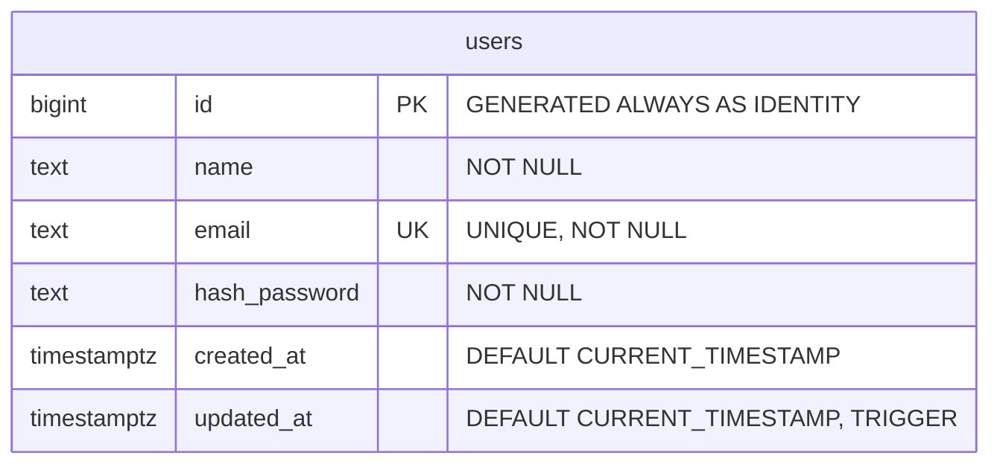

# Chi tiết bảng users (users table)

Tài liệu này mô tả chi tiết cấu trúc của bảng `users` trong cơ sở dữ liệu của hệ thống Meow. Danh sách tất cả các bảng được định nghĩa trong hệ thống có thể xem tại [db_schema-lock.json](file:///home/hungg562002/Project/meow/docs/db_schema/db_schema-lock.json).

## 1. Sơ đồ Thực thể - Mối quan hệ (ERD)

## 2. Chi tiết các bảng

### Bảng `users`
Bảng lưu trữ thông tin tài khoản người dùng của hệ thống.

| Tên Cột (Column Name) | Kiểu Dữ Liệu (Data Type) | Ràng Buộc (Constraints) | Mô Tả / Mục Đích (Description / Purpose) |
| :--- | :--- | :--- | :--- |
| `id` | `bigint` | `PRIMARY KEY`, `GENERATED ALWAYS AS IDENTITY` | Khóa chính tự động tăng của người dùng (sử dụng GENERATED ALWAYS AS IDENTITY thay vì SERIAL theo chuẩn SQL hiện đại). |
| `name` | `text` | `NOT NULL` | Tên của người dùng, được đánh chỉ mục GIN (`idx_users_name_trgm` sử dụng trigram) để tối ưu hóa tìm kiếm một phần không phân biệt hoa/thường. |
| `email` | `text` | `UNIQUE`, `NOT NULL` | Địa chỉ email dùng để đăng nhập và định danh duy nhất. |
| `hash_password` | `text` | `NOT NULL` | Mật khẩu của người dùng đã được băm (hash). |
| `created_at` | `timestamptz` | `DEFAULT CURRENT_TIMESTAMP` | Thời điểm tài khoản được tạo ra (timestamp with time zone). |
| `updated_at` | `timestamptz` | `DEFAULT CURRENT_TIMESTAMP` | Thời điểm tài khoản được cập nhật lần cuối, tự động cập nhật qua trigger `trigger_update_users_updated_at`. |

## 3. Chỉ mục (Indexes) & Ràng buộc (Constraints)

- **`users_pkey`**: Ràng buộc khóa chính (`PRIMARY KEY`) trên cột `id`.
- **`users_email_key`**: Ràng buộc duy nhất (`UNIQUE`) trên cột `email`.
- **`idx_users_name_trgm`**: Chỉ mục GIN (`USING gin (name gin_trgm_ops)`) trên cột `name`. Chỉ mục này kết hợp với extension `pg_trgm` giúp tăng tốc độ truy vấn tìm kiếm một phần (substring search) không phân biệt chữ hoa/thường qua toán tử `ILIKE`.

## 4. Trigger & Hàm tự động (Triggers & Functions)

- **Hàm `update_updated_at_column()`**:
  Hàm PL/pgSQL gán giá trị `NEW.updated_at = CURRENT_TIMESTAMP;` khi có hành động chỉnh sửa bản ghi.
- **Trigger `trigger_update_users_updated_at`**:
  Trigger chạy `BEFORE UPDATE` trên mỗi dòng của bảng `users`, gọi hàm `update_updated_at_column()` để tự động cập nhật cột `updated_at`.
